# Créer un Pool RaidZ1 avec ZFS : Guide Complet en 34 Étapes

Ce guide explique comment créer un Pool **RaidZ1** avec 4 disques en ZFS. Chaque étape est accompagnée d'une image pour illustrer les actions à réaliser.

---

## 1. Commencer avec des disques vides  
Accédez à **Disques > ZFS > Pools > Gestion** :  
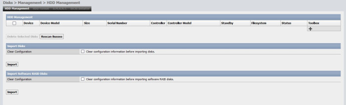

---

## 2. Importer les disques disponibles  
Cliquez sur **Importer les disques disponibles** :  
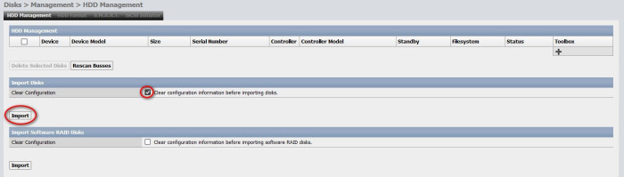

---

## 3. Appliquer les modifications pour importer  
Cliquez sur **Appliquer** pour valider l'importation :  
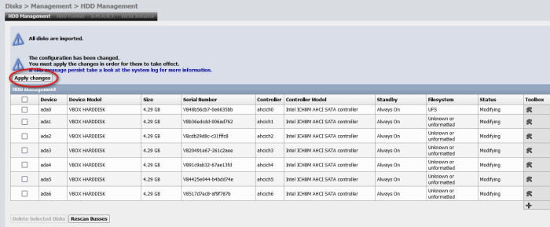

---

## 4. Disques importés  
Les disques importés apparaissent dans la liste :  
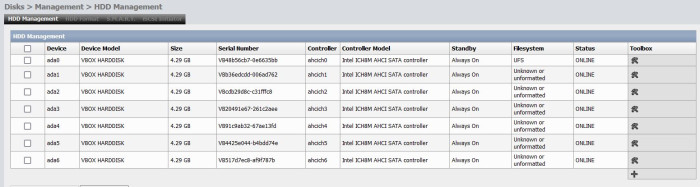

---

## 5. Système de fichiers "Inconnu"  
Les disques affichent un système de fichiers "Inconnu" et ne peuvent pas être utilisés sans formatage :  
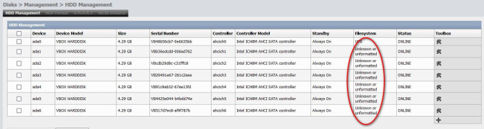

---

## 6. Vue d'ensemble des disques à formater  
Accédez à **Disques > Gestion** pour voir les disques à formater pour ZFS :  
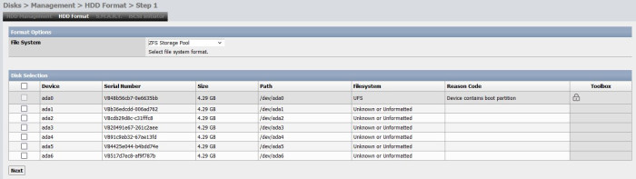

---

## 7. Sélectionner les disques à utiliser pour ZFS  
Cochez les disques que vous souhaitez utiliser pour ZFS :  
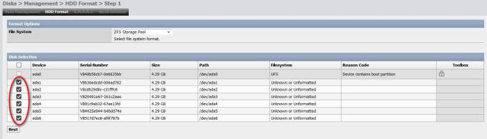

---

## 8. Vérifier les disques sélectionnés  
Assurez-vous que les disques sont correctement sélectionnés. **Ne modifiez pas les options de formatage** :  
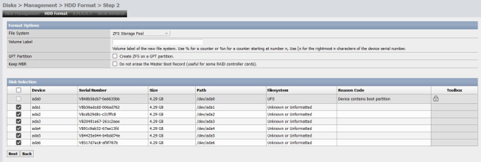

---

## 9. Formater les disques sélectionnés  
Cliquez sur **Formater** pour formater les disques sélectionnés pour ZFS :  
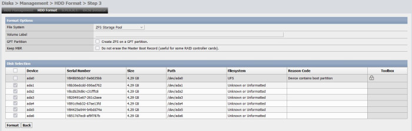

---

## 10. Disques formatés pour ZFS  
Les disques sont maintenant formatés et prêts pour ZFS :  
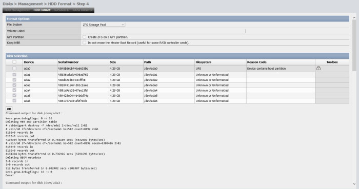

---

## 11. Disques prêts pour ZFS  
Tous les disques sont maintenant prêts à être utilisés pour ZFS :  
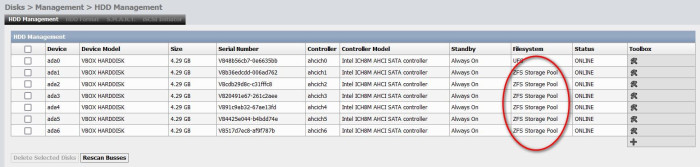

---

## 12. Accédez à la gestion des Pools  
Allez dans **Disques > ZFS > Pools > Gestion**, la page sera vide pour l'instant :  
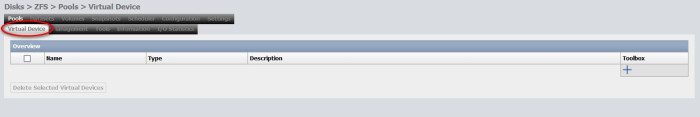

---

## 13. Aller dans la section Périphérique virtuel  
Allez dans la section **Périphérique virtuel** :  


---

## 14. Créer un nouveau périphérique virtuel  
Cliquez sur le bouton **+** pour commencer à créer un nouveau périphérique virtuel :  
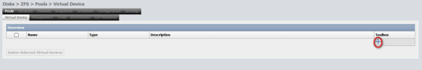

---

## 15. Liste des disques disponibles  
Les disques formatés apparaissent dans la liste des disques disponibles :  
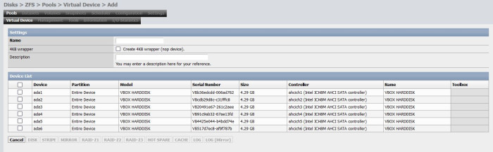

---

## 16. Sélectionner les disques et le niveau de RAID  
Cochez les disques à utiliser, donnez un nom au périphérique virtuel et sélectionnez **RaidZ1** :  
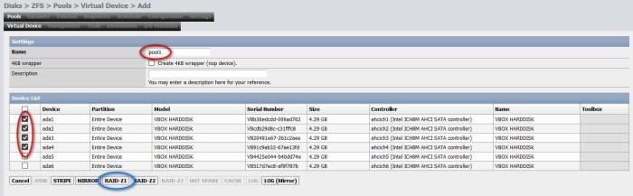

> **Attention** : Ne cochez pas "Wrapper 4KB".

---

## 17. Créer le périphérique virtuel  
Cliquez sur **Créer**, puis validez en cliquant sur **OK** :  
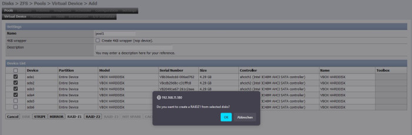

---

## 18. Appliquer les modifications  
Cliquez sur **Appliquer** pour enregistrer le périphérique virtuel créé :  
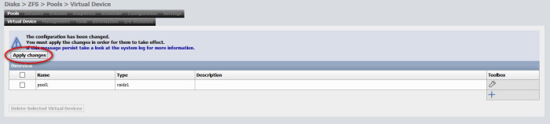

---

## 19. Vérifier le périphérique virtuel créé  
Votre périphérique virtuel est maintenant visible dans la liste :  
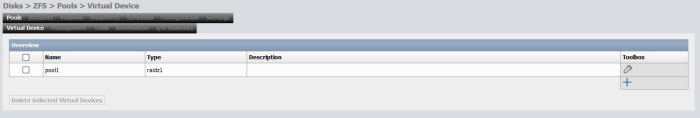

---

## 20. Retourner à la gestion des Pools  
Retournez à **Disques > ZFS > Pools > Gestion** :  
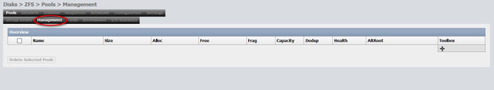

---

## 21. Ajouter un périphérique virtuel au Pool  
Cliquez sur **+** pour ajouter un périphérique virtuel au Pool :  
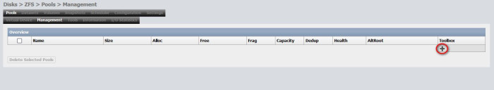

---

## 22. Sélectionner le périphérique virtuel  
Cochez le périphérique virtuel créé et donnez un nom à votre Pool (ex : `/mnt/testpool1`) :  
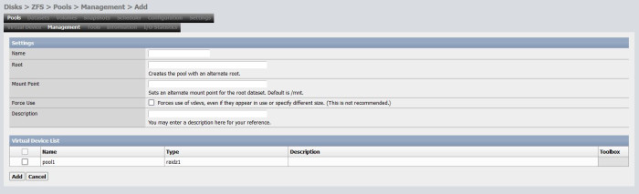

---

## 23. Ne touchez pas aux autres paramètres  
Laissez les options par défaut, puis cliquez sur **Appliquer** :  
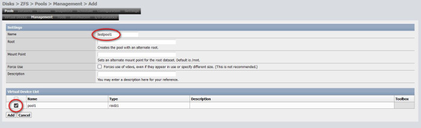

---

## 24. Pool RaidZ1 créé  
Votre Pool RaidZ1 a été créé avec succès :  
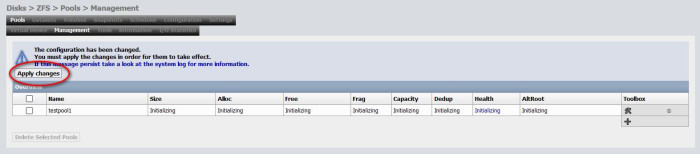

---

## 25. Pool monté et prêt à l'utilisation  
Le Pool est maintenant monté et prêt à l'utilisation :  
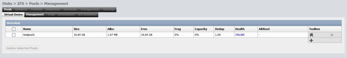

---

## 26. Détails du Pool  
Consultez les informations détaillées sur votre Pool créé :  
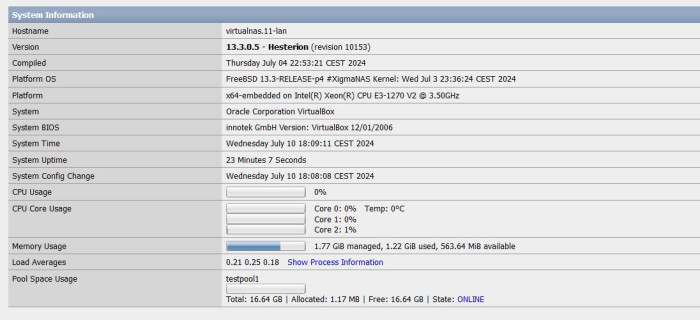

---

## 27. Mettre à jour les fonctionnalités ZFS  
Cliquez sur **Mettre à jour ZFS** en bas de la page pour activer les fonctionnalités récentes de ZFS :  
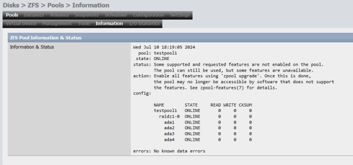

---

## 28. Sélectionner le Pool pour la mise à jour  
Cochez le Pool créé et appliquez la mise à jour des fonctionnalités ZFS :  
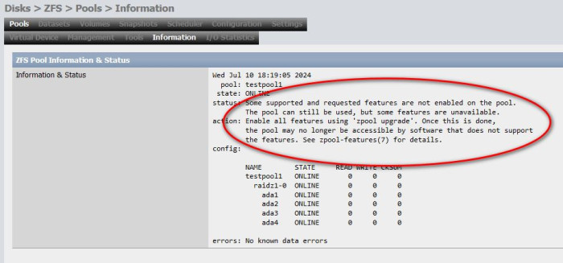

---

## 29. Mise à jour des fonctionnalités terminée  
La mise à jour des fonctionnalités est terminée :  
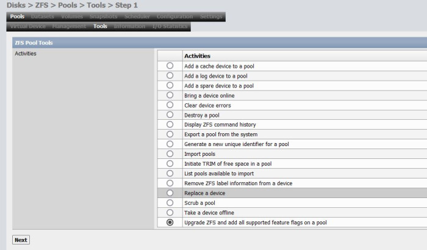

---

## 30. Vérification de l'état du Pool  
Vérifiez que l'état du Pool est "clean" :  
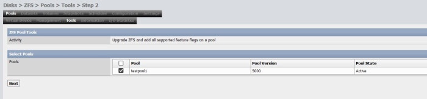

---

## 31. Synchronisation après création via la ligne de commande  
Si vous avez créé le Pool en ligne de commande, synchronisez-le pour qu'il soit visible dans l'interface web :  
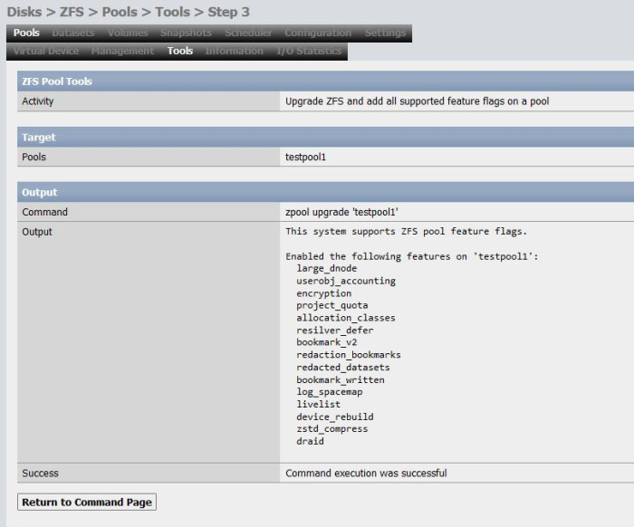

---

### Commande unique pour créer un Pool RaidZ1  
Vous pouvez créer le Pool en une seule commande via la ligne de commande :

```bash
zpool create testpool1 raidz1 /dev/disk1 /dev/disk2 /dev/disk3 /dev/disk4
```