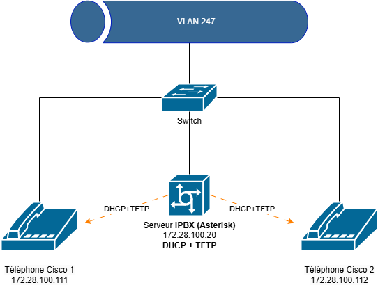

# 📌 Installation et Configuration d’Asterisk 18.x et Téléphones Cisco

Ce guide couvre les étapes nécessaires pour :
- Installer **Asterisk 18.x** sur **Debian 12**.
- Configurer un **serveur TFTP** et un **serveur DHCP** pour les téléphones Cisco.
- Configurer Asterisk avec **sip.conf**, **extensions.conf** et **voicemail.conf**.

---

## Schéma :



---

## 🔧 1. Installation d’Asterisk 18.x sur Debian 12

### 1.1 Prérequis

Mettez à jour votre système et installez les paquets essentiels :

```bash
sudo apt update && sudo apt upgrade -y
sudo apt install -y build-essential wget
```

### 1.2 Installation des dépendances

Asterisk nécessite plusieurs bibliothèques et dépendances :

```bash
sudo apt install -y libxml2-dev libncurses5-dev uuid-dev libssl-dev libjansson-dev libedit-dev \
                   libsqlite3-dev libspandsp-dev libsqlite3-dev libcurl4-openssl-dev libpcap-dev \
                   libsndfile1-dev libiksemel-dev libasound2-dev
```

### 1.3 Téléchargement et compilation d’Asterisk

Placez-vous dans `/usr/src/` et téléchargez la dernière version d'Asterisk 18 :

```bash
cd /usr/src
sudo wget https://downloads.asterisk.org/pub/telephony/asterisk/asterisk-18-current.tar.gz
sudo tar xvf asterisk-18-current.tar.gz
cd asterisk-18*/
```

Lancez la configuration et préparez la compilation :

```bash
sudo ./configure
sudo make
sudo make install
```

Installez les fichiers de configuration et les outils supplémentaires :

```bash
sudo make samples
sudo make config
```

### 1.4 Démarrer Asterisk

Démarrez le service et vérifiez son état :

```bash
sudo systemctl start asterisk
sudo systemctl status asterisk
```

Entrez dans la console d’Asterisk :

```bash
sudo asterisk -rvv
```

Pour activer le démarrage automatique :

```bash
sudo systemctl enable asterisk
```

---

## 📡 2. Mise en place d’un serveur TFTP et DHCP

### 2.1 Configuration DHCP

Ajoutez l’option **66 & 67** (TFTP) au WINDOWS serveur DHCP  pour indiquer l’adresse du serveur où les téléphones récupéreront leurs fichiers de configuration.

Exemple pour **ISC DHCP Server** (`/etc/dhcp/dhcpd.conf`) :

```ini
subnet 172.28.100.0 netmask 255.255.255.0 {
  range 172.28.100.100 172.28.100.200;
  option tftp-server-name "172.28.100.21";  # Adresse IP du serveur TFTP
}
```

Redémarrez le service :

```bash
sudo systemctl restart isc-dhcp-server
```

### 2.2 Installation et configuration de TFTP

Installez et configurez **tftpd-hpa** :

```bash
sudo apt install tftpd-hpa
```

Éditez `/etc/default/tftpd-hpa` :

```ini
TFTP_USERNAME="tftp"
TFTP_DIRECTORY="/srv/tftp"
TFTP_ADDRESS="0.0.0.0:69"
TFTP_OPTIONS="--secure"
```

Créez le répertoire TFTP et appliquez les permissions :

```bash
sudo mkdir -p /srv/tftp
sudo chown -R tftp:tftp /srv/tftp
sudo chmod -R 777 /srv/tftp
sudo systemctl restart tftpd-hpa
```

Placez les firmwares des téléphones Cisco dans `/srv/tftp/` et redémarrez le service.

---
# 📞 3. Configuration des téléphones Cisco

Les téléphones Cisco nécessitent un fichier XML pour se configurer. Voici un exemple de fichier XML de configuration pour un téléphone Cisco.

> **Remarque :** De nombreux tutoriels en ligne mentionnent des fichiers `.cnf` à la place de `.cnf.xml`. Dans la pratique, après réinitialisation, ce sont bien les `.cnf.xml` qui fonctionnent.

## Exemple de fichier de configuration : `SEPB8BEBF239674.cnf.xml`

```xml
<?xml version="1.0" encoding="UTF-8"?>
<device>
   <deviceProtocol>SIP</deviceProtocol>
   <devicePool>
      <dateTimeSetting>
         <dateTemplate>03/17/2025</dateTemplate>
         <timeZone>Eastern Standard/Daylight Time</timeZone> 
         <ntps>
              <ntp>
                  <name>!!!NTP!!</name>
                  <ntpMode>Unicast</ntpMode>
              </ntp>
         </ntps>
      </dateTimeSetting>
      <callManagerGroup>
         <members>
            <member priority="0">
               <callManager>
                  <ports>
                     <ethernetPhonePort>2000</ethernetPhonePort>
                     <sipPort>5060</sipPort>
                  </ports>
                  <processNodeName>!!!ASTERISK!!!</processNodeName>
               </callManager>
            </member>
         </members>
      </callManagerGroup>
   </devicePool>
   <sipProfile>
      <sipProxies>
         <registerWithProxy>true</registerWithProxy>
      </sipProxies>
      <sipLines>
         <line button="1">
            <featureID>9</featureID>
            <featureLabel>!!!NOM!!!</featureLabel>
            <proxy>USECALLMANAGER</proxy>
            <port>5060</port>
            <name>!!!NOM!!!1</name>
            <displayName>Cisco 7942 - !!!NOM!!!</displayName>
            <authName>!!!UTILISATEUR!!!1</authName>
            <authPassword>!!!MOTDEPASSE!!!1</authPassword>
            <sharedLine>false</sharedLine>
            <messageWaitingLampPolicy>1</messageWaitingLampPolicy>
            <messagesNumber>*97</messagesNumber>
            <ringSettingIdle>4</ringSettingIdle>
            <ringSettingActive>5</ringSettingActive>
            <contact>2801</contact>
         </line>
      </sipLines>
      <voipControlPort>5060</voipControlPort>
      <enableVad>false</enableVad>
      <preferredCodec>g711ulaw</preferredCodec>
      <dtmfAvtPayload>101</dtmfAvtPayload>
      <dtmfDbLevel>3</dtmfDbLevel>
      <dtmfOutofBand>avt</dtmfOutofBand>
   </sipProfile>
   <commonProfile>
      <phonePassword></phonePassword>
      <backgroundImageAccess>false</backgroundImageAccess>
      <callLogBlfEnabled>1</callLogBlfEnabled>
   </commonProfile>
   <loadInformation>!!!VERSION!!!</loadInformation>
   <vendorConfig>
      <disableSpeaker>false</disableSpeaker>
      <disableSpeakerAndHeadset>false</disableSpeakerAndHeadset>
      <pcPort>0</pcPort>
      <settingsAccess>1</settingsAccess>
      <garp>0</garp>
      <voiceVlanAccess>0</voiceVlanAccess>
      <videoCapability>0</videoCapability>
      <webAccess>0</webAccess>
      <webAdmin>1</webAdmin>
      <adminPassword>admin</adminPassword>
   </vendorConfig>
   <versionStamp>1143565489-a3cbf294-7526-4c29-8791-c4fce4ce4c37</versionStamp>
   <deviceSecurityMode>1</deviceSecurityMode>
</device>
```

Dans ce fichier, remplacez :

- `!!!NTP!!!` : l’IP ou FQDN de votre **Serveur NTP**.
- `!!!ASTERISK!!!` : l’IP ou FQDN de votre **Serveur Asterisk**.
- `!!!NOM!!!` : le nom convivial de votre téléphone.
- `!!!UTILISATEUR!!!` : l’utilisateur SIP configuré sur Asterisk.
- `!!!MOTDEPASSE!!!` : le mot de passe SIP correspondant.
- `!!!VERSION!!!` : la version du firmware (exemple : `SIP42.9-4-2SR3-1S`).


---

## 4. Configuration d’Asterisk

### 4.1 Fichier `sip.conf`

Exemple de configuration pour deux postes SIP :

```ini
[general]
context=internal                        ; Contexte par défaut pour les appels entrants
allowguest=no                          ; Interdire les appels invités
srvlookup=yes                          ; Recherche DNS pour les serveurs SIP
allow=all                              ; Permet tous les codecs disponibles

; Réglages de sécurité et d'enregistrement
maxexpiry=3600                         ; Durée d'expiration maximum des enregistrements SIP
defaultexpiry=3600                     ; Durée d'expiration par défaut des enregistrements
qualify=yes                            ; Contrôle la qualité de la connexion

; Paramètres de NAT (non utilisés ici car les téléphones sont sur le même réseau)
nat=no                                 ; Pas de NAT
externip=172.28.100.20                 ; Adresse IP publique (non utilisée ici)
localnet=172.28.100.0/255.255.255.0     ; Réseau local

; Configuration de l'extension 2801
[2801]
type=friend                          ; Permet de passer et recevoir des appels
secret=2801                          ; Mot de passe pour l'extension 2801
host=dynamic                         ; Adresse IP dynamique
context=internal                ; Contexte pour les appels entrants
disallow=all                         ; Désactive tous les codecs par défaut
allow=all                            ; Autorise tous les codecs disponibles
callerid="2801" <2801>                ; ID de l'appelant
dtmfmode=rfc2833                     ; Mode DTMF
dtmf=rfc2833                         ; Gestion des tonalités DTMF
pickupgroup=1                        ; Groupe de pickup

; Configuration de l'extension 2802
[2802]
type=friend                          ; Permet de passer et recevoir des appels
secret=2802                          ; Mot de passe pour l'extension 2802
host=dynamic                         ; Adresse IP dynamique
context=internal                ; Contexte pour les appels entrants
disallow=all                         ; Désactive tous les codecs par défaut
allow=all                            ; Autorise tous les codecs disponibles
callerid="2802" <2802>                ; ID de l'appelant
dtmfmode=rfc2833                     ; Mode DTMF
dtmf=rfc2833                         ; Gestion des tonalités DTMF
pickupgroup=1                        ; Groupe de pickup
```

### 4.2 Fichier `extensions.conf`

Dans le contexte `[internal]`, configurez vos postes :

```ini
[internal]
; Alias pour numérotation courte
exten => 1,1,Dial(SIP/2801,30,Tt)        ; En composant "1", appel à l'extension 2801
exten => 2,1,Dial(SIP/2802,30,Tt)        ; En composant "2", appel à l'extension 2802 (nouvelle extension)

; Extension 2801
exten => 2801,1,Answer()
exten => 2801,2,Dial(SIP/2801,60)
exten => 2801,3,Playback(vm-nobodyavail)
exten => 2801,4,VoiceMail(2801@main)
exten => 2801,5,Hangup()

; Extension 2802
exten => 2802,1,Answer()
exten => 2802,2,Dial(SIP/2802,60)
exten => 2802,3,Playback(vm-nobodyavail)
exten => 2802,4,VoiceMail(2802@main)
exten => 2802,5,Hangup()

; Accès à la messagerie vocale pour l'extension 2801
exten => 8001,1,VoicemailMain(2801@main)
exten => 8001,2,Hangup()

; Accès à la messagerie vocale pour l'extension 2802
exten => 8002,1,VoicemailMain(2802@main)
exten => 8002,2,Hangup()
```

### 4.3 Fichier `voicemail.conf`

Activez la boîte vocale pour chaque extension :

```ini
[main]
2801 => 2801

2802 => 2802
```

---

## 5. Vérification du Service

1. Retournez dans la console Asterisk :

```bash
sudo asterisk -rvvv
```

2. Assurez-vous que le module SIP est chargé :

```bash
module load chan_sip.so
```

3. Rechargez la configuration :

```bash
core reload
```

4. Vérifiez la présence de vos téléphones :

```bash
sip show peers
```

Si tout est correct, vous devriez voir vos téléphones **7001** et **7002** apparaître comme *Registered*. Vous pouvez maintenant passer des appels internes et profiter des fonctionnalités de la messagerie vocale.

---

## Conclusion

Vous avez désormais un **serveur Asterisk 18.x** opérationnel, avec des téléphones Cisco configurés via TFTP/DHCP et les bons fichiers XML. Vous pouvez adapter cette configuration en fonction de vos besoins (ajout d’extensions, mise en place de plans de numérotation avancés, etc.).

**Bon déploiement !**

