# Procédure de Configuration WiFi avec Authentification RADIUS AAA sur Borne WiFi Aruba APIN0103

## Prérequis
- Un serveur RADIUS fonctionnel  (Microsoft NPS)
- Une borne WiFi Aruba APIN0103
- Un serveur Active Directory (pour l'authentification par identifiant/mot de passe)
- Une PKI (Public Key Infrastructure) pour l'authentification par certificats

---

## 1. Configuration du Serveur RADIUS

### 1.1 Ajout de la borne Aruba comme client RADIUS

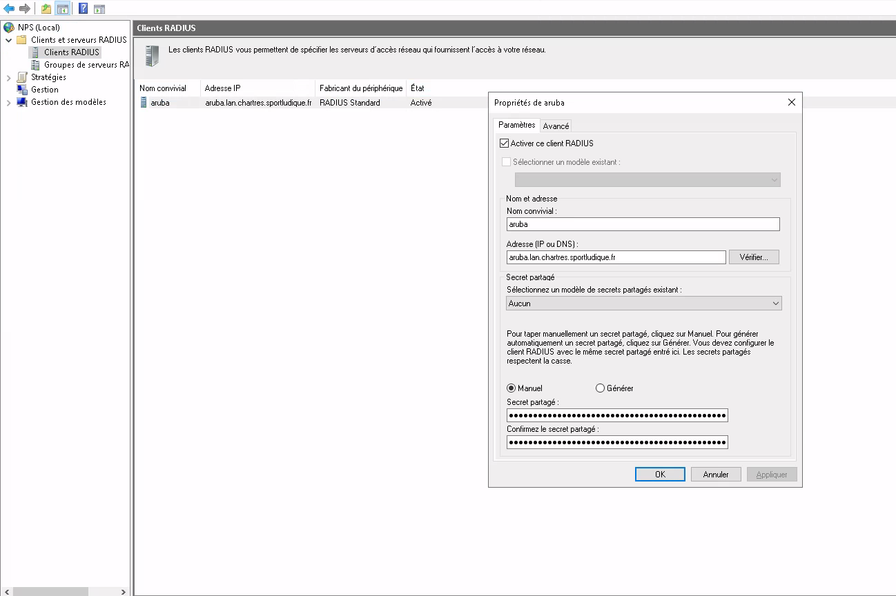

1. Connectez-vous au serveur RADIUS.
2. Ajoutez la borne Aruba en tant que client RADIUS en renseignant :
   - **L'adresse IP de la borne/nom de domaine**
   - **Une clé secrète partagée**

### 1.2 Configuration des Politiques de Demande

### 1.3 Configuration des Politiques d'Authentification

#### Etapes 1 : Nouvelle Stratégie réseau

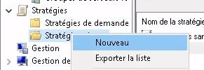

#### Etapes 2 : Nom de votre stratégie

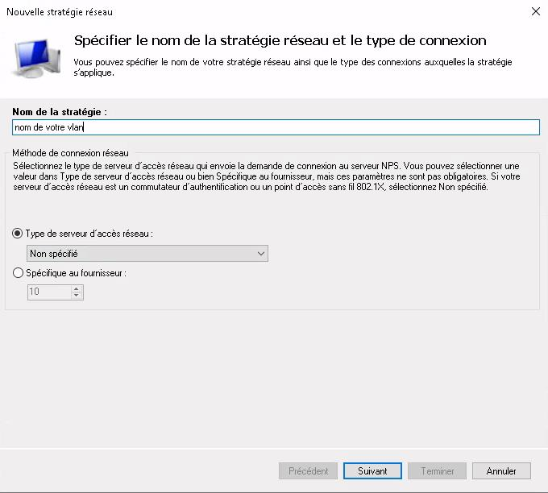

#### Etapes 3 : Ajout d'une condition
Cette condition va définir qui aura le droit de se connecter.

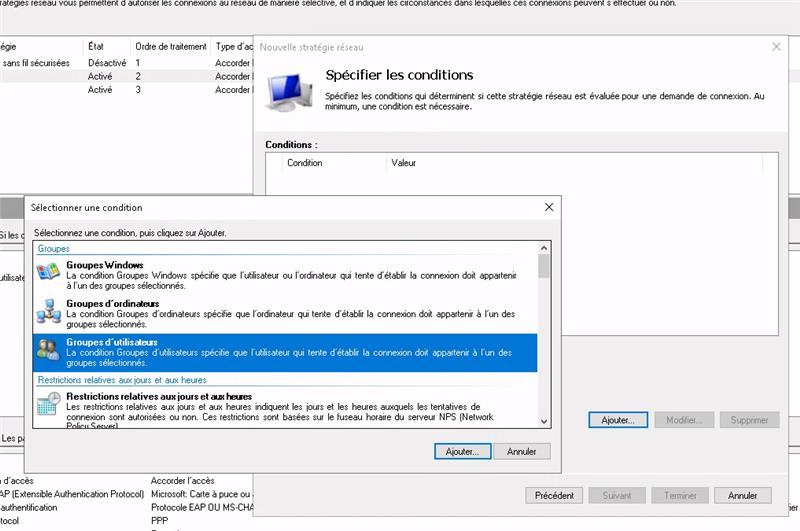

#### Etapes 4 : Choix des Authorisations de connection

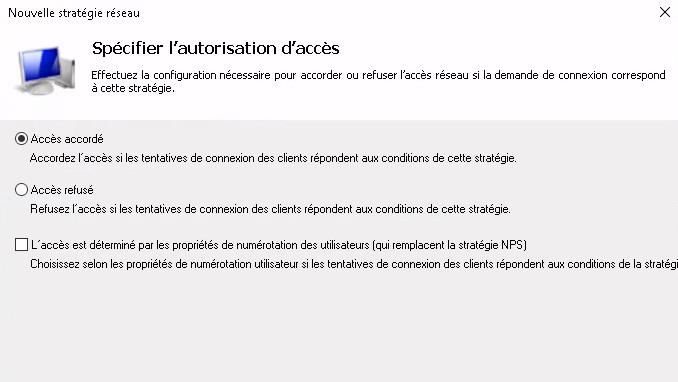

#### Etapes 4 : Choix des Authorisations de connection

#### Etapes 5 : Choix de l'authentification

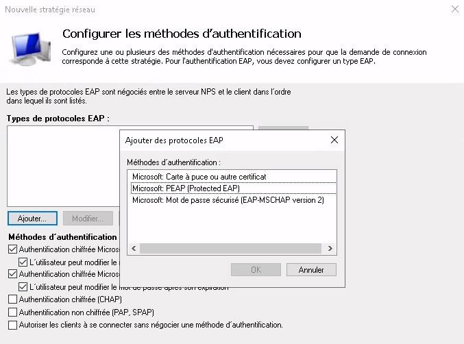

##### Authentification par identifiant/mot de passe (**EAP-PEAP avec MSCHAPv2**)

1. Créez une règle pour l'authentification par identifiant/mot de passe (**EAP-PEAP avec MSCHAPv2**).

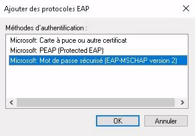

##### Authentification par certificats (**EAP-TLS**)

1. Créez une règle pour l'authentification par certificats (**EAP-TLS**).

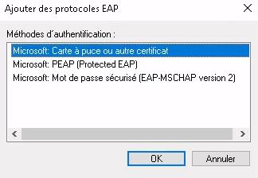

3. Assurez-vous que les utilisateurs sont bien enregistrés dans l'Active Directory ou dans la base de données des certificats.

#### Etapes 6 : Choix des paramètres de la politique d'authentification

Choisissez l'attribut Tunnel-Pvt-Group-ID pour attribuer un numéro de VLAN.

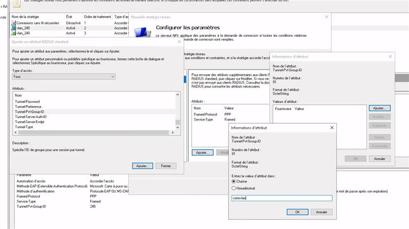

---

## 2. Configuration de la borne WiFi Aruba

### 2.1 Accès à l'interface de gestion
1. Connectez-vous à l'interface Web de la borne Aruba.
2. Allez dans **Configuration > Réseaux**.
3. Créez un **nouveau SSID sécurisé**.

### 2.2 Configuration du SSID avec RADIUS
1. **Sélectionnez le mode de sécurité WPA2-Enterprise**.
2. **Ajoutez le serveur RADIUS** :
   - **Adresse IP du serveur RADIUS**
   - **Port** (généralement `1812` pour l'authentification et `1813` pour l'accounting)
   - **Clé secrète** (doit correspondre à celle configurée sur le serveur RADIUS)
3. **Définissez les méthodes d'authentification** :
   - **EAP-PEAP** (pour identifiant/mot de passe)
   - **EAP-TLS** (pour certificats)

### 2.3 Configuration des VLANs et du Pare-feu
1. Configurez un **VLAN spécifique** pour les utilisateurs authentifiés.
2. Ajoutez des **règles de pare-feu** si nécessaire pour restreindre ou autoriser l'accès à certains services.

---

## 3. Configuration des Clients

Avant de commencer la configuration du SSID, il est essentiel que la borne WiFi puisse communiquer avec notre serveur RADIUS.

### 3.1 Configuration de la borne WiFi  

#### Étape 1 : Sécurité  

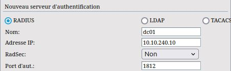

- Ajouter un **nouveau serveur RADIUS**.  

#### Étape 2 : Système  

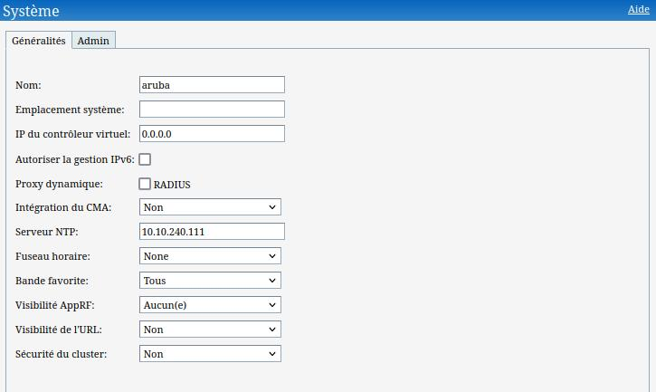

- Configurer un **serveur NTP**, car **Kerberos exige une synchronisation horaire précise** pour fonctionner avec RADIUS.  

### 3.2 Configuration du SSID  

#### Étape 1 : Création du SSID  

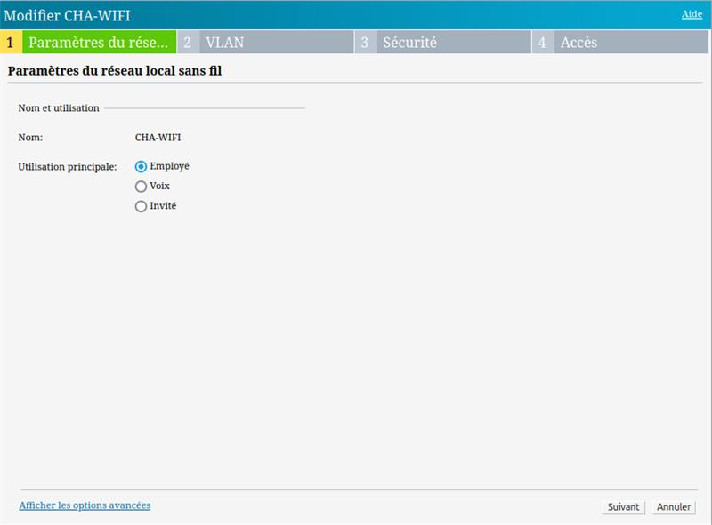

- Définir un **nom de réseau (SSID)** pour les clients.  

#### Étape 2 : Choix des VLANs  

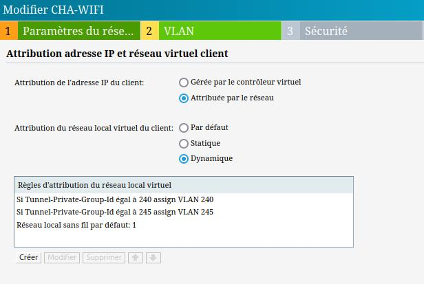

Trois options sont possibles :  
- **Par défaut**  
- **Statique**  
- **Dynamique**  

#### Étape 3 : Niveau de sécurité

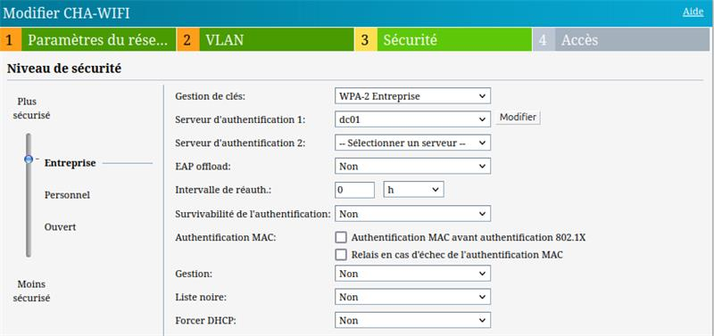

- Gestion des clés : **WPA-2 Entreprise**  
- Serveur d'authentification : **dc01**  

### 3.3 Authentification des Clients  

#### 3.3.1 Authentification par Identifiant/Mot de Passe (EAP-PEAP)  
1. Connectez l'appareil au **SSID configuré**.  
2. Saisissez les **identifiants de l'utilisateur** (`utilisateur` + mot de passe).  
3. Acceptez le **certificat du serveur RADIUS** si demandé.  

#### 3.3.2 Authentification par Certificats (EAP-TLS)  
1. **Installez le certificat utilisateur** sur l'appareil.  
2. **Connectez l'appareil** au SSID configuré.  
3. Sélectionnez **le certificat utilisateur** pour l'authentification.  
4. **Vérifiez la connexion**.  

---

## 4. Tests et Dépannage

### 4.1 Vérification des Logs RADIUS
- Sur le serveur RADIUS, **vérifiez les logs d’authentification** pour détecter d'éventuelles erreurs.

### 4.2 Vérification des Logs de la Borne Aruba
- Accédez aux **logs de la borne** via SSH ou l’interface Web.

### 4.3 Tests de Connexion
- **Testez avec différents utilisateurs** et certificats pour valider la configuration.

---

## 5. Conclusion
En suivant cette procédure, vous aurez mis en place une connexion **WiFi sécurisée avec une authentification basée sur un serveur RADIUS**, permettant l'accès par **identifiant/mot de passe** ou par **certificats utilisateur**.
