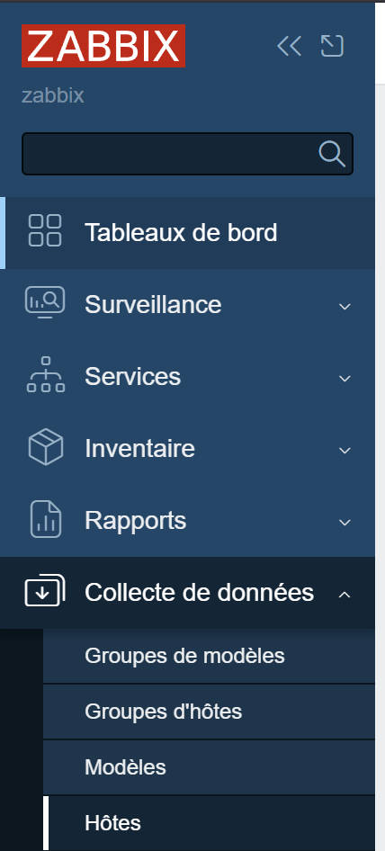

# Installation de Zabbix sur Debian

Cette documentation vous guide à travers l'installation de Zabbix sur Debian avec MySQL comme base de données.

## Étape 1 : Préparer le système

Avant de commencer l'installation, mettez à jour votre système Debian :

`sudo apt update`  
`sudo apt upgrade -y`

## Étape 2 : Installer les dépendances

Installez les paquets nécessaires, y compris Apache, MySQL et PHP :

`sudo apt install -y apache2 mysql-server php php-mbstring php-gd php-xml php-bcmath php-mysql libapache2-mod-php`

## Étape 3 : Ajouter le dépôt Zabbix

Téléchargez et ajoutez le dépôt officiel de Zabbix à votre système :

`wget https://repo.zabbix.com/zabbix/6.0/debian/pool/main/z/zabbix-release/zabbix-release_6.0-1+debian10_all.deb`  
`sudo dpkg -i zabbix-release_6.0-1+debian10_all.deb`  
`sudo apt update`

## Étape 4 : Installer Zabbix

Installez le serveur Zabbix, le frontend et l'agent :

`sudo apt install -y zabbix-server-mysql zabbix-frontend-php zabbix-agent zabbix-sql-scripts`

## Étape 5 : Configurer la base de données MySQL

1. **Se connecter à MySQL** :

`sudo mysql -u root -p`

2. **Créer la base de données et l'utilisateur Zabbix** :

`CREATE DATABASE zabbix character set utf8mb4 collate utf8mb4_bin;`  
`CREATE USER 'zabbix'@'localhost' IDENTIFIED BY 'motdepasse_zabbix';`  
`GRANT ALL PRIVILEGES ON zabbix.* TO 'zabbix'@'localhost';`  
`FLUSH PRIVILEGES;`  
`EXIT;`

3. **Importer les tables Zabbix** :

`sudo zcat /usr/share/doc/zabbix-sql-scripts/mysql/server.sql.gz | sudo mysql -u root -p zabbix`

## Étape 6 : Configurer Zabbix Server

1. **Modifier la configuration de Zabbix** :

Ouvrez le fichier de configuration de Zabbix pour spécifier les informations de la base de données :

`sudo nano /etc/zabbix/zabbix_server.conf`

Modifiez les lignes suivantes :

`DBHost=localhost`  
`DBName=zabbix`  
`DBUser=zabbix`  
`DBPassword=motdepasse_zabbix`

2. **Redémarrer et activer le service Zabbix** :

`sudo systemctl restart zabbix-server`  
`sudo systemctl enable zabbix-server`

## Étape 7 : Configurer Apache pour le Frontend Zabbix

1. **Créer une configuration Apache pour Zabbix** :

Créez un fichier de configuration Apache pour Zabbix :

`sudo nano /etc/apache2/sites-available/zabbix.conf`

Ajoutez la configuration suivante :

```config
<VirtualHost *:80> DocumentRoot /usr/share/zabbix ServerName zabbix.local

<Directory /usr/share/zabbix> Options FollowSymLinks AllowOverride None Require all granted </Directory>

ErrorLog ${APACHE_LOG_DIR}/error.log CustomLog ${APACHE_LOG_DIR}/access.log combined </VirtualHost>
```


2. **Activer la configuration et redémarrer Apache** :

`sudo a2ensite zabbix.conf`  
`sudo a2enmod rewrite`  
`sudo systemctl restart apache2`

## Étape 8 : Compléter l'installation via le Frontend Web

1. Accédez à l'interface web de Zabbix en ouvrant votre navigateur et en allant à `http://votre-ip/zabbix`.

2. Suivez les instructions de l'assistant d'installation :
   - Assurez-vous que les paramètres de la base de données sont correctement renseignés (hôte, nom de la base de données, utilisateur et mot de passe).
   - Laissez les paramètres par défaut pour la configuration du serveur Zabbix et poursuivez l'installation.

## Étape 9 : Configurer l'Agent Zabbix (optionnel)

1. Installez l'agent Zabbix sur les machines que vous souhaitez surveiller :

`sudo apt install -y zabbix-agent`

2. Modifiez la configuration de l'agent pour qu'il pointe vers le serveur Zabbix :

`sudo nano /etc/zabbix/zabbix_agentd.conf`

Modifiez la ligne `Server` pour y mettre l'adresse IP de votre serveur Zabbix :

`Server=adresse_ip_du_serveur_zabbix`

3. Redémarrez l'agent Zabbix :

`sudo systemctl restart zabbix-agent`  
`sudo systemctl enable zabbix-agent`


## Etape 10 : Ajouter un hote a l'appli zabbix



=> Crée un hote => mettez les infos 

Une fois tout ca fait vous devriez voir l'hote apparaitre dans la liste des hotes

